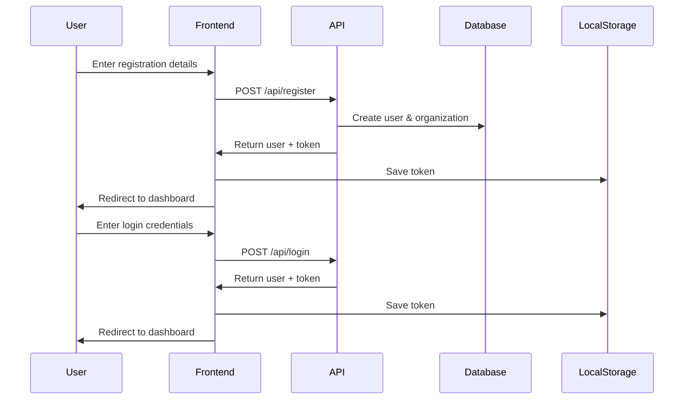

# Authentication API - Complete Guide

## 📋 Overview

This guide covers both **Login** and **Register** endpoints for the MeetUI application.

**Base URL:** `http://localhost:8000/api`  
**Authentication:** Bearer Token

---

## 🔐 Register (Signup)

### Endpoint
```
POST /api/register
```

### Request Body
```json
{
  "name": "John Doe",
  "email": "john.doe@example.com",
  "password": "SecurePass123!",
  "password_confirmation": "SecurePass123!",
  "organization_name": "Acme Corporation"
}
```

### Success Response (201)
```json
{
  "data": {
    "id": 1,
    "name": "John Doe",
    "email": "john.doe@example.com",
    // ... other user fields
  },
  "meta": {
    "token": "1|xxxxxxxxxxxx",
    "organization": {
      "id": 1,
      "name": "Acme Corporation",
      // ... organization fields
    }
  },
  "message": "Registration successful!"
}
```

### Key Points
- Creates user account
- Creates or links to organization
- Returns token immediately (auto-login)
- Organization matching happens by name (case-insensitive)

---

## 🔑 Login

### Endpoint
```
POST /api/login
```

### Request Body
```json
{
  "email": "john.doe@example.com",
  "password": "SecurePass123!"
}
```

### Success Response (200)
```json
{
  "data": {
    "id": 1,
    "name": "John Doe",
    "email": "john.doe@example.com",
    // ... other user fields
  },
  "meta": {
    "token": "1|xxxxxxxxxxxx"
  },
  "message": "Login successfully!"
}
```

---

## 💻 Quick Implementation

### Register + Auto-Login
```javascript
async function register(formData) {
  const response = await fetch('http://localhost:8000/api/register', {
    method: 'POST',
    headers: {
      'Content-Type': 'application/json',
      'Accept': 'application/json'
    },
    body: JSON.stringify({
      name: formData.name,
      email: formData.email,
      password: formData.password,
      password_confirmation: formData.passwordConfirmation,
      organization_name: formData.organizationName
    })
  });

  const data = await response.json();
  
  if (response.ok) {
    // Save token and redirect
    localStorage.setItem('auth_token', data.meta.token);
    localStorage.setItem('user', JSON.stringify(data.data));
    window.location.href = '/dashboard';
  } else {
    // Handle validation errors
    console.error('Error:', data.errors);
  }
}
```

### Login
```javascript
async function login(email, password) {
  const response = await fetch('http://localhost:8000/api/login', {
    method: 'POST',
    headers: {
      'Content-Type': 'application/json',
      'Accept': 'application/json'
    },
    body: JSON.stringify({ email, password })
  });

  const data = await response.json();
  
  if (response.ok) {
    localStorage.setItem('auth_token', data.meta.token);
    localStorage.setItem('user', JSON.stringify(data.data));
    window.location.href = '/dashboard';
  } else {
    console.error('Login failed:', data.message);
  }
}
```

---

## 🔒 Using the Token

After login or register, use the token in all authenticated requests:

```javascript
const token = localStorage.getItem('auth_token');

// Example: Get current user
fetch('http://localhost:8000/api/user', {
  headers: {
    'Authorization': `Bearer ${token}`,
    'Accept': 'application/json'
  }
})
.then(response => response.json())
.then(data => console.log(data));
```

---

## ✅ Validation Rules

### Register
- **name**: Required, string, max 255 characters
- **email**: Required, valid email format, unique
- **password**: Required, minimum 8 characters
- **password_confirmation**: Required, must match password
- **organization_name**: Required, string, max 255 characters

### Login
- **email**: Required, valid email format
- **password**: Required

---

## ❌ Error Handling

All errors return this format:
```json
{
  "message": "Error description",
  "errors": {
    "field_name": ["Error message"]
  }
}
```

### Common Errors

#### Register
- `422`: Validation errors (missing fields, invalid format, email taken, password mismatch)
- `500`: Server error

#### Login
- `422`: Invalid credentials, validation errors
- `500`: Server error

---

## 📖 Detailed Documentation

- **[Register API Details](./REGISTER_API.md)** - Complete register documentation
- **[Login API Details](./LOGIN_API.md)** - Complete login documentation
- **[API Quick Start](./API_QUICK_START.md)** - Quick reference for all endpoints

---

## 🧪 Testing

### With Postman
Import `postman_collection.json` to test both endpoints.

### Test Credentials (register first)
```json
{
  "name": "Test User",
  "email": "test@example.com",
  "password": "TestPass123!",
  "password_confirmation": "TestPass123!",
  "organization_name": "Test Company"
}
```

Then use same credentials to test login.

---

## 🔄 Complete Auth Flow



---

## 💡 Best Practices

1. **Token Storage**: Use localStorage or sessionStorage
2. **Error Handling**: Always display validation errors to users
3. **Loading States**: Show loading indicators during API calls
4. **Auto-logout**: Handle 401 errors (token expired)
5. **Password Strength**: Add client-side validation
6. **HTTPS**: Always use HTTPS in production

---

## 📞 Support

For detailed examples, check:
- React implementation in [LOGIN_API.md](./LOGIN_API.md) or [REGISTER_API.md](./REGISTER_API.md)
- Vue.js implementation in the same files
- Axios setup examples

**Need help?** Contact the backend team or check the detailed documentation files.

